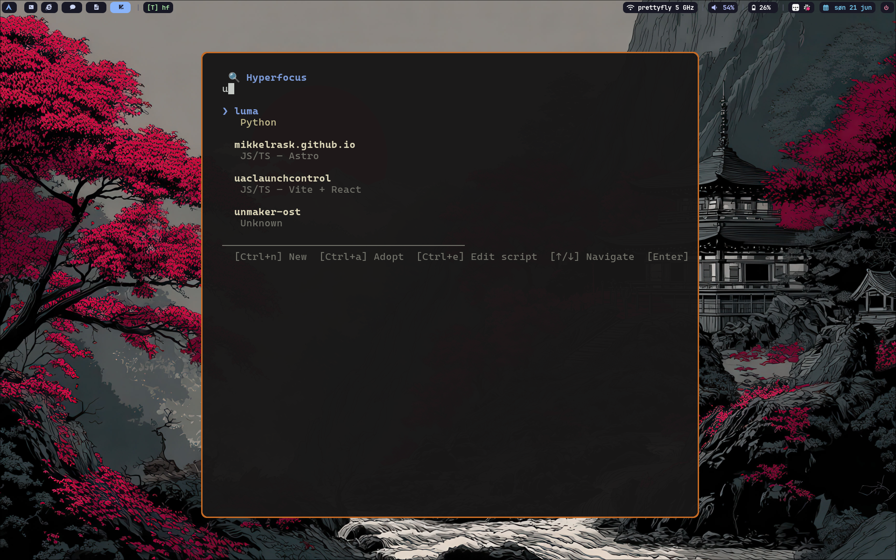

# Hyperfocus

A terminal UI project launcher and scaffolder - browse, create, and switch between your development projects with fuzzy search, mouse support, and per-project tmux launch scripts.



## Dependencies

**Runtime:**

- [`tmux`](https://github.com/tmux/tmux) - session management
- [`bash`](https://www.gnu.org/software/bash/) - launch script execution
- [`git`](https://git-scm.com/) - initialised in every new project

**Optional (for scaffolding new projects):**

- Python projects - [`uv`](https://docs.astral.sh/uv/)
- JS/TS projects - [`Node.js`](https://nodejs.org/) + [`npm`](https://www.npmjs.com/)

**Build:**

- [Go](https://go.dev/) 1.26+

## Install

```bash
go install github.com/mikkelrask/hyperfocus@latest
```

If ~/go/bin is not in your path, you can add it _or_ symlink the binary to a path that is.

```bash
# Add to $PATH
PATH="$PATH:$HOME/go/bin"
# OR symlink the binary
ln -s $HOME/go/bin/hyperfocus $HOME/.local/bin/hf
```

This lets you invoke it with `hf`

### Build from source

It can also be installed by building from source:

```bash
git clone https://github.com/mikkelrask/hyperfocus ~/Repos/hf
cd ~/Repos/hf
go build -o hf .
cp hf ~/.local/bin/    # or anywhere on your $PATH
```

The binary is standalone — it only needs `~/.config/hf/` at runtime and the external tools listed under Dependencies.

## Quick start

```bash
# Launch the TUI
hf

# Adopt an existing repository
hf --adopt ~/Repos/my-project
```

## Usage

### TUI

```
hf
```

Opens a full-terminal list of your registered projects. Type to filter, click or press Enter to open one.

| Key | Action |
|---|---|
| `↑` `↓` | Navigate the list |
| `Enter` | Open selected project (runs its launch script) |
| `Ctrl+n` | Create a new project |
| `Ctrl+a` | Adopt an existing repository |
| `Ctrl+e` | Edit selected project's launch script (`$EDITOR`) |
| `Ctrl+q` / `Ctrl+c` | Quit |
| `Esc` | Clear search / quit |

**Mouse:** Click a project to select and open it.

### Adopt an existing repo

```bash
hf --adopt ~/Repos/some-project
# or from inside the repo:
cd ~/Repos/some-project && hf --adopt .
```

Registers the repo with Hyperfocus and creates a default launch script at `~/.config/hf/projects/some-project/launch.sh`.

### Create a new project

Press `Ctrl+n` in the TUI and follow the wizard:

1. **Project name** - alphanumeric, hyphens, underscores, dots
2. **Type** - Python or JavaScript / TypeScript
3. **Framework** (JS/TS only):
   - Next.js
   - Vite + React
   - Vite + Vue
   - Vite + Svelte
   - Astro
   - Plain npm

Hyperfocus will scaffold the project in `~/Repos/`, run `git init`, and create a launch script you can customise later.

## Launch scripts

Every project gets a shell script at:

```
~/.config/hf/projects/<name>/launch.sh
```

When you open a project from the TUI, this script runs and handles tmux session creation.

### Shared template

New launch scripts are generated from a shared template at:

```
~/.config/hf/launch-template.sh
```

Edit this file once and every **future** project will use your custom layout. The default template opens a tmux session with `nvim` in the top pane and a shell in the bottom.

### Per-project overrides

Use `Ctrl+e` inside the TUI to jump straight to the selected project's `launch.sh` in `$EDITOR`. Changes here only affect that one project.

Template placeholders:

| Placeholder | Substituted with |
|---|---|
| `{name}` | Project name |
| `{path}` | Absolute path to the project |
| `{type}` | Project type description |

## Data

All Hyperfocus state lives under `~/.config/hf/` (or `$XDG_CONFIG_HOME/hf/`):

```
~/.config/hf/
├── config.yaml            # Language / framework definitions (edit to add your own)
├── launch-template.sh     # Shared launch script template (edit to change defaults)
├── projects.json          # Project registry (JSON)
└── projects/
    └── <name>/
        └── launch.sh       # Per-project launch script
```

On first run, `config.yaml` and `launch-template.sh` are created automatically.

## Configuration

### Adding languages and frameworks

Edit `~/.config/hf/config.yaml` to add your own project types and scaffolding commands.

Each language defines:

```yaml
languages:
  - name: rust
    label: Rust
    detect:           # files to sniff when adopting a repo
      - Cargo.toml
    frameworks:
      - name: cargo
        label: Cargo
        create: ["cargo", "init", "{name}"]
        post_create: []
```

The `detect` list is checked when you run `hf --adopt <path>`. If any of those files exist in the directory, the language is auto-detected.

### Customising the launch template

Edit `~/.config/hf/launch-template.sh` to change the default tmux layout for all future projects. See [Launch scripts](#launch-scripts) above for available placeholders.

## License

BEER-WARE
